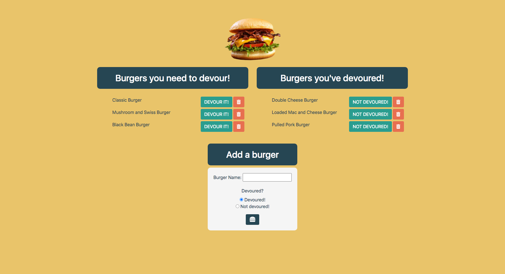

# Burger Logger

## Description
[Burger Logger](https://dry-anchorage-08139.herokuapp.com/) is a fun app to keep track of burgers that have been devoured and burgers that have yet to be devoured. This app is a simple representation of the usefulness of a model-view controller (MVC). The following were critical to the effectiveness of this app:
* JawsDB as the database
* Heroku to host the app
* An MVC structure
* Handlebars
* Node.JS
* Express
* Express-Handlebars
* MySQL
* An ORM

View the deployed application here: https://dry-anchorage-08139.herokuapp.com/

View the application on my portfolio here: https://jeanarose.github.io/my-portfolio/portfolio.html

## Burger Logger

## Table of Contents

- [Installation](#installation)
- [Usage](#usage)
- [Credits](#credits)
- [License](#license)
- [Tests](#tests)

## Installation
1. Go to the [GitHub repository for Burger Logger](https://github.com/jeanarose/burger-logger).
2. Click the green **Code** button.
3. Copy the SSH key.
4. In your terminal, go into the directory that you want to host Burger Logger.
5. Use the command `git clone [insert SSH key URL]` and click **Enter** (_Requires Git_).

## Usage
Burger Logger can be used, simply, to keep track of which burgers you have devoured. As a developer, this application provides a simple but comprehensive example of how an MVC is structured and functions. 

## Credits
The following people contributed to the success of this application. You can view their GitHub profiles by clicking on their names:
* [Jonathan Watson](https://github.com/jonathanjwatson)
* [Peter Colella](https://github.com/petercolella)

The following sites were used to find code to make Weather Dashboard function properly:
* [Coolors](https://coolors.co/palettes/trending)
* [Free PNG Images:](http://freepngimages.com/bacon-burger-transparent-background/) Burger image

## License
Copyright (c) 2021 Jeana Rose Mathis

MIT License

Permission is hereby granted, free of charge, to any person obtaining a copy
of this software and associated documentation files (the "Software"), to deal
in the Software without restriction, including without limitation the rights
to use, copy, modify, merge, publish, distribute, sublicense, and/or sell
copies of the Software, and to permit persons to whom the Software is
furnished to do so, subject to the following conditions:

The above copyright notice and this permission notice shall be included in all
copies or substantial portions of the Software.

THE SOFTWARE IS PROVIDED "AS IS", WITHOUT WARRANTY OF ANY KIND, EXPRESS OR
IMPLIED, INCLUDING BUT NOT LIMITED TO THE WARRANTIES OF MERCHANTABILITY,
FITNESS FOR A PARTICULAR PURPOSE AND NONINFRINGEMENT. IN NO EVENT SHALL THE
AUTHORS OR COPYRIGHT HOLDERS BE LIABLE FOR ANY CLAIM, DAMAGES OR OTHER
LIABILITY, WHETHER IN AN ACTION OF CONTRACT, TORT OR OTHERWISE, ARISING FROM,
OUT OF OR IN CONNECTION WITH THE SOFTWARE OR THE USE OR OTHER DEALINGS IN THE
SOFTWARE.

## Tests
Interested in testing Burger Logger? Ensure the following:
1. When the user clicks the **DEVOUR IT** button, the burger is removed from the "Burgers you need to devour," section and moved to the "Burgers you've devoured," section. 
2. When the user clicks the **NOT DEVOURED** button, the burger is removed from the "Burgers you've devoured," section and moved to the "Burgers you need to devour," section.
3. When the user clicks the trash button on either section, the corresponding burger is removed. 
4. When the user adds a new burger, it is added to the corresponding section. 

---

© 2020 Trilogy Education Services, LLC, a 2U, Inc. brand. Confidential and Proprietary. All Rights Reserved.
